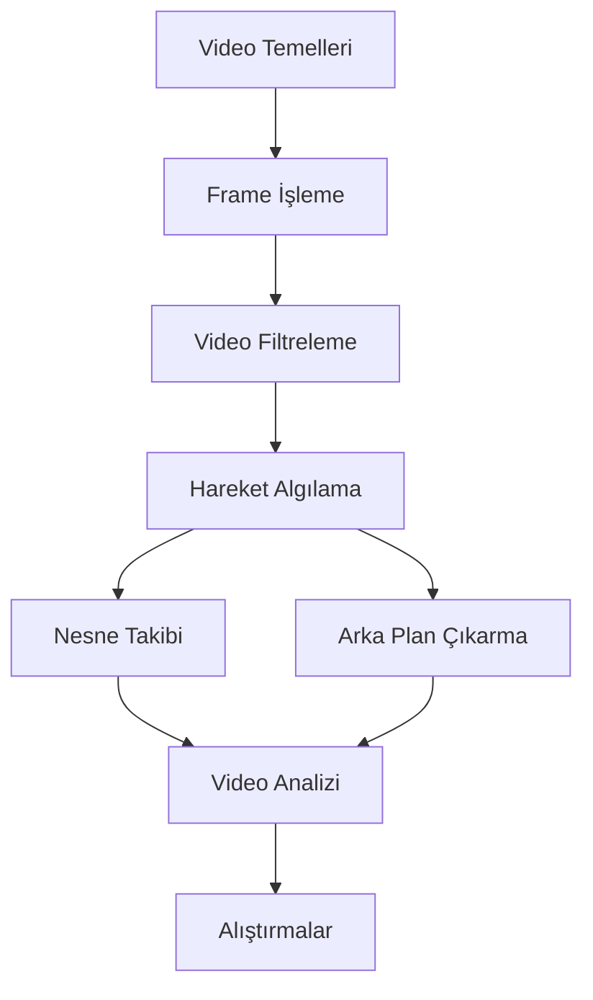

# 🎬 Video İşleme ile OpenCV

Bu bölümde OpenCV kullanarak video işleme tekniklerini öğreneceksiniz. Video okuma, yazma, frame işleme, hareket algılama ve daha birçok konuyu kapsar.

## 📚 Bu Bölümde Öğrenecekleriniz

- ✅ Video dosyalarını okuma ve yazma
- ✅ Frame-by-frame video işleme
- ✅ Video filtreleme ve efektler
- ✅ Hareket algılama teknikleri
- ✅ Nesne takibi (Object Tracking)
- ✅ Arka plan çıkarma (Background Subtraction)
- ✅ Real-time video işleme
- ✅ Webcam ile çalışma
- ✅ Video analizi ve istatistikleri

## 📖 İçindekiler

### 1. [Video Temelleri](01-video-temelleri.py)
- Video dosyası okuma ve yazma
- Video özellikleri (FPS, çözünürlük, codec)
- Frame ekstraktı
- Webcam erişimi
- Video metadata'sı

### 2. [Frame İşleme](02-frame-isleme.py)
- Frame-by-frame işleme
- Frame manipülasyonu
- Frame-rate kontrolü
- Frame buffer yönetimi
- Synchronized frame işleme

### 3. [Video Filtreleme](03-video-filtreleme.py)
- Real-time blur ve keskinleştirme
- Renk düzeltmeleri
- Video stabilizasyon (temel)
- Histogram eşitleme
- Custom video filtreleri

### 4. [Hareket Algılama](04-hareket-algilama.py)
- Frame differencing
- Background subtraction
- Optical flow
- Motion vectors
- Hareket analizi

### 5. [Nesne Takibi](05-nesne-takibi.py)
- Template matching
- CamShift tracking
- Kalman filter
- Multi-object tracking
- Tracking performans analizi

### 6. [Arka Plan Çıkarma](06-arka-plan-cikarma.py)
- MOG2 background subtractor
- KNN background subtractor
- GMM modeli
- Foreground/background separation
- Shadow detection

### 7. [Video Analizi](07-video-analizi.py)
- Video özellikleri analizi
- Motion statistics
- Object counting
- Scene change detection
- Video quality metrics

### 8. [Alıştırmalar](08-alistirmalar/)
- Temel video işleme alıştırmaları
- Hareket algılama projeleri
- Real-time uygulamalar
- Mini projeler

## 🎯 Öğrenme Yolu



## 💻 Gereksinimler

### Temel Gereksinimler
```bash
pip install opencv-python
pip install numpy
pip install matplotlib
```

### Ek Gereksinimler (İleri Özellikler)
```bash
pip install scipy          # Gelişmiş algoritma desteği
pip install scikit-learn   # Machine learning özellikleri
pip install imutils        # Video işleme yardımcıları
```

### Video Codec Desteği
```bash
# Windows için
pip install opencv-python-headless

# Linux için
sudo apt-get install python3-opencv
sudo apt-get install ffmpeg
```

## ⚡ Hızlı Başlangıç

### 1. Video Dosyası Okuma
```python
import cv2

# Video dosyasını aç
cap = cv2.VideoCapture('video.mp4')

while True:
    ret, frame = cap.read()
    if not ret:
        break
        
    cv2.imshow('Video', frame)
    if cv2.waitKey(1) & 0xFF == ord('q'):
        break

cap.release()
cv2.destroyAllWindows()
```

### 2. Webcam Erişimi
```python
import cv2

# Webcam'i aç (0 = varsayılan kamera)
cap = cv2.VideoCapture(0)

while True:
    ret, frame = cap.read()
    cv2.imshow('Webcam', frame)
    
    if cv2.waitKey(1) & 0xFF == ord('q'):
        break

cap.release()
cv2.destroyAllWindows()
```

### 3. Video Kaydetme
```python
import cv2

cap = cv2.VideoCapture(0)

# Video yazıcı tanımla
fourcc = cv2.VideoWriter_fourcc(*'XVID')
out = cv2.VideoWriter('output.avi', fourcc, 20.0, (640, 480))

while True:
    ret, frame = cap.read()
    if ret:
        out.write(frame)
        cv2.imshow('Recording', frame)
        
        if cv2.waitKey(1) & 0xFF == ord('q'):
            break

cap.release()
out.release()
cv2.destroyAllWindows()
```

## 📁 Dosya Yapısı

```
03-Video-Isleme/
├── README.md                     # Bu dosya
├── 01-video-temelleri.py         # Video temel işlemleri
├── 02-frame-isleme.py            # Frame-by-frame işleme
├── 03-video-filtreleme.py        # Video filtreleme
├── 04-hareket-algilama.py        # Hareket algılama
├── 05-nesne-takibi.py            # Nesne takip algoritmaları
├── 06-arka-plan-cikarma.py       # Background subtraction
├── 07-video-analizi.py           # Video analiz teknikleri
├── 08-alistirmalar/              # Pratik alıştırmalar
│   ├── README.md
│   ├── alistirma-1.md            # Temel video işleme
│   ├── alistirma-2.md            # Hareket algılama projesi
│   ├── alistirma-3.md            # Real-time video analiz
│   ├── cozumler/                 # Çözüm dosyaları
│   └── test-videolar/            # Test video dosyaları
├── examples/                     # Örnek projeler
│   ├── security-camera.py        # Güvenlik kamerası uygulaması
│   ├── motion-tracker.py         # Hareket takipçisi
│   ├── background-remover.py     # Arka plan silici
│   └── video-analyzer.py         # Video analiz aracı
└── utils/                        # Yardımcı araçlar
    ├── video_utils.py            # Video işleme yardımcıları
    ├── codec_helper.py           # Codec desteği
    └── performance_monitor.py    # Performans izleme
```

## 🎥 Desteklenen Video Formatları

| Format | Uzantı | Okuma | Yazma | Notlar |
|--------|--------|-------|-------|--------|
| MP4    | .mp4   | ✅    | ✅    | En yaygın format |
| AVI    | .avi   | ✅    | ✅    | Windows standardı |
| MOV    | .mov   | ✅    | ✅    | QuickTime format |
| MKV    | .mkv   | ✅    | ❌    | Sadece okuma |
| WMV    | .wmv   | ✅    | ✅    | Windows Media |
| WebM   | .webm  | ✅    | ✅    | Web için optimize |

## 🚀 İleri Konular

### Real-time İşleme
- Multi-threading ile performans
- GPU acceleration (CUDA)
- Memory optimization
- Frame buffering

### Machine Learning Entegrasyonu
- YOLO ile nesne tespiti
- Deep learning modelleri
- Pose estimation
- Face recognition

### Computer Vision Uygulamaları
- Surveillance systems
- Traffic monitoring
- Sports analysis
- Medical imaging

## ⚠️ Önemli Notlar

### Performans Optimizasyonu
- **Frame skip**: Gereksiz frame'leri atlayın
- **ROI (Region of Interest)**: Sadece ilgili bölgeyi işleyin
- **Multi-threading**: CPU'yu verimli kullanın
- **Memory management**: Büyük videolarla dikkatli olun

### Codec Uyumluluğu  
- **H.264**: En yaygın, iyi sıkıştırma
- **XVID**: Açık kaynak, uyumlu
- **MJPEG**: Düşük sıkıştırma, hızlı işleme
- **FFV1**: Lossless, arşivleme için

### Sistem Kaynakları
- **RAM**: HD video için 8GB+ önerilir
- **CPU**: Multi-core işlemci avantajlı
- **GPU**: CUDA desteği opsiyonel ama faydalı
- **Storage**: SSD hızlı video erişimi için

## 💡 İpuçları

### Başlangıç için
1. Önce webcam ile başlayın (kolay test)
2. Küçük video dosyalarıyla çalışın
3. Frame-by-frame anlayın
4. Kısa video klipler oluşturun

### İleri seviye için
1. Real-time performans odaklı çalışın
2. Memory leak'leri kontrol edin
3. Multi-camera desteği ekleyin
4. Cloud processing'i düşünün

## 🔧 Debugging İpuçları

### Yaygın Sorunlar
- **Video açılmıyor**: Codec desteği kontrol edin
- **Yavaş performans**: Frame skip kullanın
- **Memory leak**: VideoCapture.release() unutmayın
- **Codec hatası**: FFmpeg kurulumunu kontrol edin

### Test Araçları
```python
# Video bilgilerini kontrol et
cap = cv2.VideoCapture('video.mp4')
print(f"FPS: {cap.get(cv2.CAP_PROP_FPS)}")
print(f"Width: {cap.get(cv2.CAP_PROP_FRAME_WIDTH)}")
print(f"Height: {cap.get(cv2.CAP_PROP_FRAME_HEIGHT)}")
print(f"Frame Count: {cap.get(cv2.CAP_PROP_FRAME_COUNT)}")
```

## 🎓 Öğrenme Sırası

1. **Temel Seviye**: Video okuma/yazma → Frame işleme
2. **Orta Seviye**: Filtreleme → Hareket algılama  
3. **İleri Seviye**: Nesne takibi → Arka plan çıkarma
4. **Uzman Seviye**: Video analizi → Custom algoritmalar

## 🤝 Topluluk ve Kaynaklar

### Faydalı Linkler
- [OpenCV Video Tutorials](https://docs.opencv.org/master/dd/d43/tutorial_py_video_display.html)
- [Video Processing with Python](https://github.com/opencv/opencv-python)
- [Computer Vision Zone](https://www.computervision.zone/)

### Örnek Projeler
- Güvenlik kamerası sistemi
- Trafik izleme uygulaması
- Spor analiz aracı
- Video editing pipeline

---

**🎬 Hazır mısınız?** Video işleme dünyasına dalın ve OpenCV'nin gücünü keşfedin!

*Bu bölüm Eren Terzi tarafından hazırlanmıştır.*